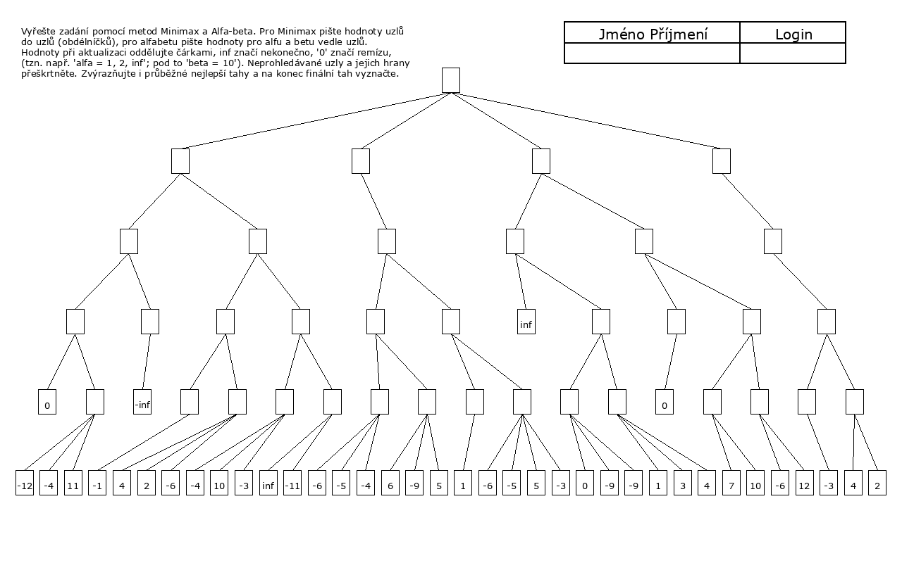

# AlphaBeta-MinMax

Script for visualization and of the 1st project for the IZU course. 
This version is configured for the tree structure of the academic year 2025/2026.

## Requirements and Installation

To run the script, you need to have Python and the Graphviz library installed.

1. **Python package installation:**
   ```bash
   pip install graphviz
   ```

2. **System Graphviz installation:**
   The rendering library requires Graphviz to be installed on your system as well (installing just the python package via pip is not enough).
   * **Windows:** Download and install from the official Graphviz website (make sure to check the option to add it to the system PATH during installation).
   * **macOS:** `brew install graphviz`
   * **Linux (Ubuntu/Debian):** `sudo apt-get install graphviz`

## How it works

The tree structure is hardcoded in the script using this array

```python
structure_seq = [4, 2, 1, 2, 1, 2, 2, 2, 2, 2, 1, 2, 1, 2, 2, 2, 2, -1, 2, 1, 2, 2, -1, 3, -1, 1, 3, 3, 2, 3, 3, 1, 4, 3, 3, -1, 2, 2, 1, 2]
```

### What you need to change

The only thing you need to modify before running is the `terminals_seq` array inside the `main.py` file. 
Fill in the leaf (terminal) values from your assignment from left to right, top to bottom.

```python
# Modify this array according to your assignment:
terminals_seq = [math.inf, 0, -math.inf, 0, -12, -4, 11, -1, 4, 2, -6, -4, 10, -3, math.inf, -11, -6, -5, -4, 6, -9, 5, 1, -6, -5, 5, -3, 0, -9, -9, 1, 3, 4, 7, 10, -6, 12, -3, 4, 2]
```
*Don't forget to use `math.inf` and `-math.inf` for the infinity and minus infinity values.*

### Running the script

After setting the terminals, simply run the script:

```bash
python main.py
```

After successful execution, a file named `result.png` will be generated in the same folder, showing the fully calculated tree with MiniMax values in the nodes and AlfaBeta values next to them plus crossed out nodes aswell.

## Example

### Empty assignment
This is what an empty assignment looks like:



### Correct solution
After adding your terminals into `terminals_seq` and running the script, you will get a result like this. You can use it to check the step-by-step updates of alpha and beta values with crossed out nodes:

